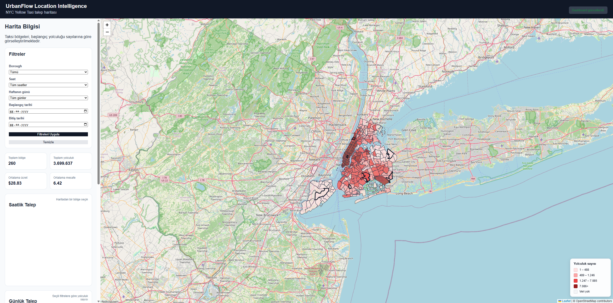
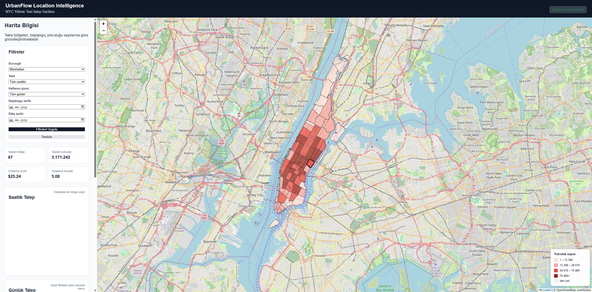
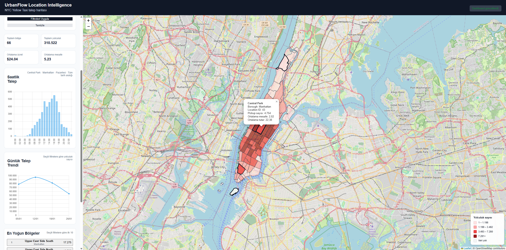
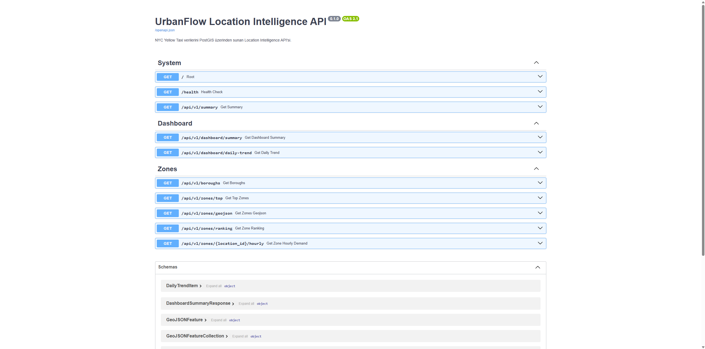

# UrbanFlow Location Intelligence

[](https://github.com/mertcanpolat/urbanflow-location-intelligence/actions/workflows/tests.yml)

UrbanFlow Location Intelligence is a full-stack geospatial data project developed to analyse New York City Yellow Taxi demand by location and time.

The project combines spatial ETL, PostgreSQL/PostGIS, a FastAPI backend, and an interactive Leaflet dashboard. Its main purpose is not only to produce a working application, but also to demonstrate how a GIS-oriented data product can be designed with maintainable software architecture, testing, containerisation, and technical documentation.

## Project Status

### Sprint 1 — Data Pipeline and Dashboard

- ETL pipeline
- PostgreSQL and PostGIS
- FastAPI
- Leaflet
- Chart.js
- Materialized View
- Interactive dashboard

### Sprint 2 — Software Architecture and Engineering

- Modular code structure
- Router–Service–Repository architecture
- Logging
- Centralised exception handling
- Pytest test suite
- Dockerfile
- Docker Compose
- Git repository
- GitHub repository
- Technical documentation

### Sprint 3 — Performance and Interactive Analytics

- Materialized-view query optimisation
- GeoJSON geometry simplification
- Automated materialized-view refresh after ETL
- API response-time middleware
- Loading and empty states
- Active-filter summary
- Borough-based automatic map zoom
- Interactive taxi-zone selection controls
- Weekday–hour demand heatmap
- Expanded automated test coverage

## Project Objectives

UrbanFlow aims to answer questions such as:

- Which taxi zones generate the highest pickup demand?
- How does demand change by date and hour?
- How are trips distributed across boroughs?
- Which zones should be prioritised for mobility, transport, or location-intelligence analysis?
- How can large spatial datasets be exposed through a clean and testable API?

## Technology Stack

| Layer | Technologies |
|---|---|
| Data source | NYC Yellow Taxi trip data, NYC Taxi Zones |
| ETL | Python, GeoPandas/Pandas-based processing scripts |
| Database | PostgreSQL 17, PostGIS 3.5 |
| Backend | FastAPI, SQLAlchemy, Psycopg |
| Validation | Pydantic |
| Frontend | HTML, CSS, JavaScript |
| Mapping | Leaflet |
| Charts | Chart.js |
| Testing | Pytest, HTTPX |
| Containerisation | Docker, Docker Compose |
| Version control | Git, GitHub |

## System Architecture

The application follows a layered architecture:

```text
Client / Dashboard
        |
        v
FastAPI Router Layer
        |
        v
Service Layer
        |
        v
Repository Layer
        |
        v
PostgreSQL + PostGIS
```

### Router Layer

The router layer defines HTTP endpoints, validates incoming parameters, and returns API responses.

Main router modules:

- `api/routers/system.py`
- `api/routers/dashboard.py`
- `api/routers/zones.py`

### Service Layer

The service layer contains application-level logic and coordinates operations between routers and repositories.

Main service modules:

- `api/services/dashboard_service.py`
- `api/services/zone_service.py`

### Repository Layer

The repository layer is responsible for SQL queries and database access.

Main repository modules:

- `api/repositories/dashboard_repository.py`
- `api/repositories/zone_repository.py`

This separation keeps HTTP handling, business logic, and database operations independent from one another.

## Data Flow

```text
Public taxi datasets
        |
        v
Download scripts
        |
        v
Inspection and validation
        |
        v
ETL and data loading
        |
        v
PostgreSQL + PostGIS
        |
        v
Materialized views and SQL queries
        |
        v
FastAPI endpoints
        |
        v
Leaflet map and Chart.js dashboard
```

## Project Structure

```text
urbanflow-location-intelligence/
│
├── api/
│   ├── core/
│   │   ├── exceptions.py
│   │   └── logging_config.py
│   │
│   ├── models/
│   │   ├── filters.py
│   │   └── responses.py
│   │
│   ├── repositories/
│   │   ├── dashboard_repository.py
│   │   └── zone_repository.py
│   │
│   ├── routers/
│   │   ├── dashboard.py
│   │   ├── system.py
│   │   └── zones.py
│   │
│   ├── services/
│   │   ├── dashboard_service.py
│   │   └── zone_service.py
│   │
│   ├── database.py
│   └── main.py
│
├── database/
│   ├── init/
│   └── queries/
│
├── src/
│   ├── download_taxi_zones.py
│   ├── download_yellow_trips.py
│   ├── inspect_taxi_zones.py
│   ├── inspect_yellow_trips.py
│   ├── load_taxi_zones.py
│   └── load_yellow_trips.py
│
├── tests/
│   ├── conftest.py
│   ├── test_dashboard.py
│   ├── test_system.py
│   └── test_zones.py
│
├── web/
│   ├── app.js
│   ├── index.html
│   └── styles.css
│
├── .dockerignore
├── .gitignore
├── Dockerfile
├── compose.yaml
└── requirements.txt
```

## Screenshots

### Dashboard Overview



### Taxi Zone Demand Map



### Demand Analysis



### API Documentation




## Main Features

### Spatial Taxi-Zone Map

Taxi zones are returned from the backend as GeoJSON and displayed on a Leaflet map.

The map can be used to:

- visualise spatial demand distribution,
- compare taxi zones,
- inspect zone-level metrics,
- filter results by borough and time,
- connect map interactions with dashboard charts.

### Dashboard KPIs

The dashboard exposes summary indicators such as:

- total trip count,
- filtered trip count,
- average trip distance,
- average total amount,
- number of taxi zones,
- date range of the dataset.

### Demand Analysis

The application supports:

- daily demand trends,
- hourly demand profiles,
- top taxi-zone rankings,
- an interactive 7 × 24 weekday–hour demand heatmap,
- borough filtering,
- hour and weekday filtering,
- date filtering,
- zone-level analysis,
- coordinated map, KPI, chart, and ranking updates.

### Materialized View

Aggregated demand data is stored in:

```sql
analytics.zone_hourly_demand
```

The materialized view groups demand by taxi zone, date, and hour. This reduces repeated computation for dashboard queries and substantially improves response performance compared with querying the raw trip table.

The ETL process refreshes the materialized view automatically after new taxi-trip data is loaded:

```sql
REFRESH MATERIALIZED VIEW analytics.zone_hourly_demand;
```

## Sprint 3 Performance Results

Sprint 3 focused on query performance, network payload reduction, observability, and interactive spatiotemporal analysis.

### Query Performance

The raw `core.trips` table contains approximately 3.7 million records and occupies about 1.28 GB. The analytical materialized view is approximately 17 MB.

| Query | Raw table | Materialized view | Improvement |
|---|---:|---:|---:|
| Zone ranking | 177.6 ms | 21.1 ms | ~8.4× faster |
| Date-filtered dashboard query | 389 ms | 5.3 ms | ~73× faster |

### GeoJSON Optimisation

Taxi-zone geometries are simplified before they are returned to the browser:

```sql
ST_SimplifyPreserveTopology(
    geom,
    0.0001
)
```

| Metric | Before | After |
|---|---:|---:|
| GeoJSON response size | ~2.19 MB | ~381 KB |
| Average response time | ~286 ms | ~134 ms |
| Payload reduction | — | ~83% |
| Response-time improvement | — | ~53% |

The selected tolerance reduces payload size while preserving the visual quality and topology of the taxi-zone polygons.

### API Timing Middleware

FastAPI middleware records request duration and adds a response header:

```text
X-Process-Time-Ms: 51.15
```

Example log output:

```text
GET /api/v1/dashboard/summary 200 78.59 ms
GET /api/v1/zones/geojson 200 141.25 ms
```

### Weekday–Hour Demand Heatmap

The dashboard includes an interactive 7 × 24 demand matrix:

```text
7 weekdays × 24 hours = 168 cells
```

Each cell represents the total taxi demand for one weekday and hour. Hovering over a cell displays:

- weekday,
- hour,
- trip count.

The heatmap responds to borough and date filters. Hour and weekday filters are intentionally excluded from the heatmap request so that the complete temporal pattern remains visible.

## API Endpoints

FastAPI automatically generates interactive API documentation.

After the application starts:

- Swagger UI: `http://localhost:8000/docs`
- ReDoc: `http://localhost:8000/redoc`
- Dashboard: `http://localhost:8000/map`

### System Endpoints

| Method | Endpoint | Description |
|---|---|---|
| GET | `/` | Returns basic API information |
| GET | `/health` | Checks API and database health |
| GET | `/map` | Serves the web dashboard |
| GET | `/api/v1/summary` | Returns general dataset statistics |

### Dashboard Endpoints

| Method | Endpoint | Description |
|---|---|---|
| GET | `/api/v1/dashboard/summary` | Returns filtered dashboard KPIs |
| GET | `/api/v1/dashboard/daily-trend` | Returns daily trip-demand values |
| GET | `/api/v1/dashboard/weekday-hour-heatmap` | Returns demand grouped by weekday and hour |

### Zone Endpoints

| Method | Endpoint | Description |
|---|---|---|
| GET | `/api/v1/boroughs` | Returns available borough names |
| GET | `/api/v1/zones/top` | Returns zones with the highest overall demand |
| GET | `/api/v1/zones/geojson` | Returns filtered taxi zones as GeoJSON |
| GET | `/api/v1/zones/ranking` | Returns filtered zone rankings |
| GET | `/api/v1/zones/{location_id}/hourly` | Returns hourly demand for one taxi zone |

## Environment Variables

Create a `.env` file in the project root.

Example:

```env
POSTGRES_DB=urbanflow
POSTGRES_USER=urbanflow_user
POSTGRES_PASSWORD=change_this_password
POSTGRES_PORT=5432

PGADMIN_EMAIL=admin@example.com
PGADMIN_PASSWORD=change_this_password
PGADMIN_PORT=5050

DB_HOST=localhost
DB_PORT=5432
DB_NAME=urbanflow
DB_USER=urbanflow_user
DB_PASSWORD=change_this_password
```

Do not commit the real `.env` file to GitHub.

For a public repository, an `.env.example` file should be included with placeholder values.

## Running with Docker Compose

### Requirements

- Docker Desktop
- Docker Compose
- Git

### 1. Clone the repository

```bash
git clone https://github.com/mertcanpolat/urbanflow-location-intelligence.git
cd urbanflow-location-intelligence
```

### 2. Create the environment file

Create `.env` in the project root and add the required variables.

### 3. Build and start the services

```bash
docker compose up --build
```

The Compose configuration starts:

- PostGIS database
- pgAdmin
- FastAPI application

### 4. Open the services

- API: `http://localhost:8000`
- API documentation: `http://localhost:8000/docs`
- Dashboard: `http://localhost:8000/map`
- pgAdmin: `http://localhost:5050`

### 5. Stop the services

```bash
docker compose down
```

To remove the database and pgAdmin volumes as well:

```bash
docker compose down -v
```

> Warning: removing volumes deletes the persisted local database data.

## Running Locally without Docker

### 1. Create a virtual environment

Windows PowerShell:

```powershell
python -m venv .venv
.\.venv\Scripts\Activate.ps1
```

Linux or macOS:

```bash
python -m venv .venv
source .venv/bin/activate
```

### 2. Install dependencies

```bash
python -m pip install --upgrade pip
pip install -r requirements.txt
```

### 3. Configure the database connection

Create the `.env` file and make sure PostgreSQL/PostGIS is running.

When the API runs outside Docker, `DB_HOST` should normally be:

```env
DB_HOST=localhost
```

### 4. Start the API

```bash
python -m uvicorn api.main:app --reload
```

## Running the Tests

The project uses Pytest for API and application tests.

Run all tests:

```bash
pytest
```

Run tests with verbose output:

```bash
pytest -v
```

Run a specific test module:

```bash
pytest tests/test_zones.py -v
```

The current test suite contains 12 automated tests covering:

- dashboard summary,
- daily demand trend,
- weekday–hour heatmap,
- filter validation,
- invalid date ranges,
- borough listing,
- zone ranking,
- zone hourly demand,
- unknown zones,
- system endpoints.

Current result:

```text
12 passed
```

The complete test suite also runs automatically through GitHub Actions.

## Logging

Application logging is configured centrally in:

```text
api/core/logging_config.py
```

The routers and services use named loggers to record:

- incoming requests,
- successful operations,
- query results,
- invalid resources,
- database failures,
- unexpected application errors.

Centralised logging makes debugging and production monitoring easier than scattered `print()` statements.

## Exception Handling

Global exception handlers are registered in:

```text
api/core/exceptions.py
```

This provides consistent error responses and prevents raw internal errors from being exposed directly to API consumers.

Expected examples include:

- `404 Not Found` for an unknown taxi zone,
- `503 Service Unavailable` for database connectivity problems,
- `500 Internal Server Error` for unexpected database or application failures.

## Database Connection Management

The SQLAlchemy engine is defined in:

```text
api/database.py
```

The database URL is created from environment variables.

Current connection-pool configuration:

- `pool_pre_ping=True`
- `pool_size=5`
- `max_overflow=10`

`pool_pre_ping` checks whether a pooled database connection is still valid before it is reused.

## Why PostGIS?

PostGIS extends PostgreSQL with spatial data types and geospatial operations.

In UrbanFlow it enables the application to:

- store taxi-zone geometries,
- execute spatial SQL,
- return geometries as GeoJSON,
- connect trip statistics to geographic zones,
- support future proximity, accessibility, and spatial-pattern analyses.

## Why FastAPI?

FastAPI was selected because it provides:

- automatic request validation,
- Pydantic response models,
- automatic Swagger and ReDoc documentation,
- dependency injection,
- clear route organisation,
- good performance for data APIs,
- straightforward testing with HTTPX and Pytest.

## Why Router–Service–Repository?

The layered architecture improves maintainability.

```text
Router:
Receives HTTP requests and returns HTTP responses.

Service:
Applies application rules and coordinates the operation.

Repository:
Communicates with PostgreSQL and executes SQL.
```

Benefits:

- database code does not remain inside endpoint functions,
- HTTP concerns do not leak into SQL modules,
- components can be tested independently,
- future features can be added with less duplication,
- the codebase is closer to real production application structures.

## Current Limitations

- The project currently focuses on local and Docker-based execution.
- Production deployment configuration is not yet complete.
- Database migrations are not yet managed by a migration tool.
- Authentication and authorisation are not implemented.
- Test coverage reporting is not yet included.
- The dashboard is optimised primarily for desktop use.
- Materialized-view refresh is automated after ETL, but scheduled and concurrent refresh strategies are not yet implemented.

## Planned Improvements

### Deployment and DevOps

- Add `.env.example`
- Add production-specific Compose configuration
- Add health checks for all services
- Pin dependency versions
- Add coverage reporting
- Add reverse-proxy configuration
- Add cloud deployment
- Add release and deployment workflows

### Data and Performance

- Add caching for frequently requested dashboard responses
- Add scheduled or asynchronous ETL jobs
- Evaluate `REFRESH MATERIALIZED VIEW CONCURRENTLY`
- Introduce pagination where required
- Add larger and multi-period taxi datasets
- Add query-performance regression benchmarks
- Add database migration management

### Advanced Location Intelligence

- Spatiotemporal hotspot analysis
- Demand clustering
- Origin–destination analysis
- Accessibility analysis
- Demand forecasting
- Taxi-zone segmentation
- Location scoring
- Service-area optimisation
- Heatmap-driven cross-filtering of the map and ranking panels

### User Experience

- Improve mobile and tablet responsiveness
- Add an advanced map legend
- Add downloadable reports and data exports
- Add layer controls
- Add comparison mode
- Improve chart interactions
- Add accessible keyboard interactions
- Add visual feedback for selected heatmap cells

## Learning Outcomes

This project is designed as a practical GIS software-engineering learning programme.

Topics applied in the project include:

- spatial ETL,
- relational and spatial database design,
- PostGIS queries,
- REST API design,
- layered backend architecture,
- frontend-to-API communication,
- interactive web mapping,
- dashboard development,
- environment-variable management,
- automated testing,
- exception handling,
- logging,
- Docker containerisation,
- Git and GitHub workflows,
- technical documentation.

## Sprint 3 Summary

Sprint 3 transformed UrbanFlow from a functional dashboard into a more performant and interactive analytical application.

Completed work includes:

1. moving dashboard analytics to an indexed materialized view,
2. simplifying GeoJSON geometries with topology preservation,
3. automating analytical-view refresh after ETL,
4. measuring API response times,
5. adding loading and empty states,
6. improving map navigation and filter feedback,
7. adding interactive zone-selection controls,
8. implementing a weekday–hour demand heatmap,
9. expanding the automated test suite to 12 passing tests.

## Development Approach

UrbanFlow is developed in weekly sprints.

Each sprint includes:

1. A working software increment
2. Architectural improvement
3. Testing
4. Technical explanation
5. Documentation
6. Git commit and GitHub update

The goal is to build both a functioning location-intelligence application and a documented portfolio project that demonstrates GIS, data engineering, backend development, and software-engineering skills.

## Author

**Mertcan Polat**

Geomatics Engineer and GIS professional focusing on:

- Geographic Information Systems
- Location Intelligence
- Spatial Data Engineering
- Python
- PostGIS
- Web GIS
- Data Analytics

GitHub: [mertcanpolat](https://github.com/mertcanpolat)

## Licence

This project is licensed under the MIT License.

See the [LICENSE](LICENSE) file for details.